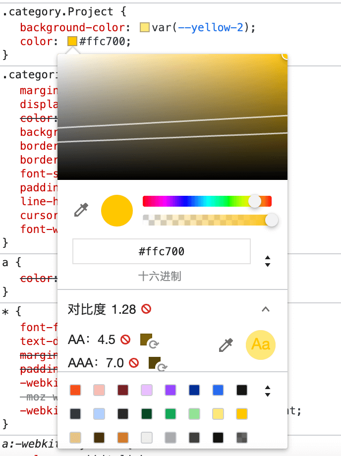

不同人对颜色对比度的感知不同，当两种颜色相似时，对比度低，当两种颜色相异时，对比度高。

全世界大约 3.2 亿人有色觉缺陷。大约每 12 名男性和 200 名女性中就有 1 人患有某种形式的“色盲”，这意味着大约 5% 的用户无法按照你预期的方式体验你的网站。

## WebAIM 准则

[WebAIM 准则](https://webaim.org/standards/wcag/)将文本和背景颜色的对比度分为三个级别：

- A（3:1）：满足残障人士的基本视觉需求。
- AA（4.5:1）：整体消除了残障人士访问 Web 内容障碍。
  > 字号大于 24px 或大于 18.66px 且加粗，至少为 3:1
- AAA（7:1）：为残障人士提供了对 Web 可访问性的改进和增强。
  > 字号大于 24px 或大于 18.66px 且加粗，至少为 4.5:1

如果你不确定站点是否满足 WebAIM 准则，可以使用 [WAVE Web 可访问性评估工具](https://wave.webaim.org/report) 来评估。

注意下面显示的对比度的差异。

## 工具

浏览器提供了一些工具来帮助检查页面的对比度。

1. 模拟视觉缺陷功能

   > 控制台 > 渲染 > 模拟视觉缺陷  
   > DevTools > Rendering > Emulate vision deficiency

2. 检查文字的对比度

   > 控制台 > CSS 概览 > 颜色 > 对比度问题
   > DevTools > CSS Overview > Colors > Contrast

3. 快速调整对比度

## 参考资料

- [颜色和对比度辅助功能](https://web.dev/color-and-contrast-accessibility/?utm_source=devtools#-2)
